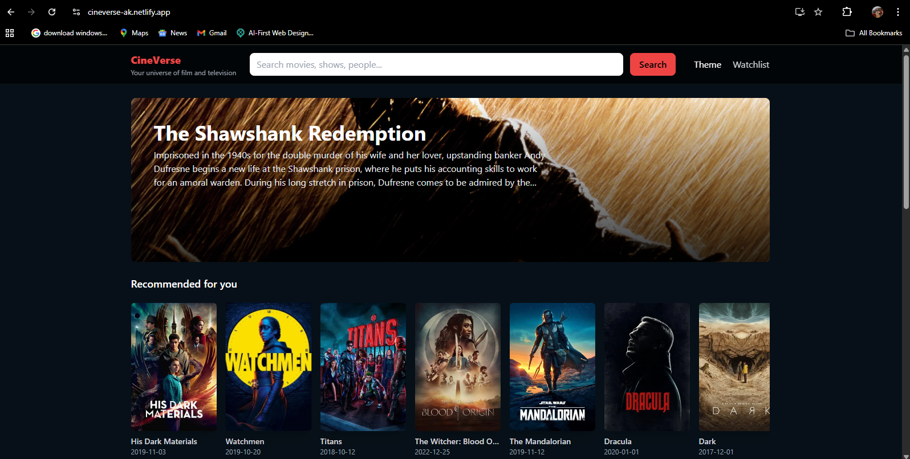

<h1 align="center">🎬 CineVerse – Your Universe of Film & TV</h1>

  
  

  
  
  
  

---

## 🌟 Overview  
**CineVerse** is a dynamic and responsive movie discovery app built with **React** and powered by the **TMDB API**.  
It allows users to search, explore, and add favorite movies to their watchlist — all in a clean, cinematic UI.  

🔗 **Live Demo:** [cineverse-ak.netlify.app](https://cineverse-ak.netlify.app)  
💻 **GitHub Repo:** [github.com/akbolaji-04/Cineverse](https://github.com/akbolaji-04/Cineverse)

---

## 🚀 Features  
✅ Search and explore movies in real-time  
✅ View trailers, ratings, genres, cast & release info  
✅ Add or remove items from your **Watchlist** (saved in localStorage)  
✅ Light / Dark mode toggle 🌗  
✅ Fully responsive, sleek design  

---

## 🧠 Tech Stack  

| Category | Tools Used |
|-----------|-------------|
| **Frontend Framework** | ⚛️ React.js |
| **Styling** | 🎨 Tailwind CSS |
| **API** | 🎬 TMDB API |
| **Routing** | 🔄 React Router DOM |
| **State & Storage** | 🧩 Context API + Local Storage |
| **Deployment** | 🌍 Netlify |

---
